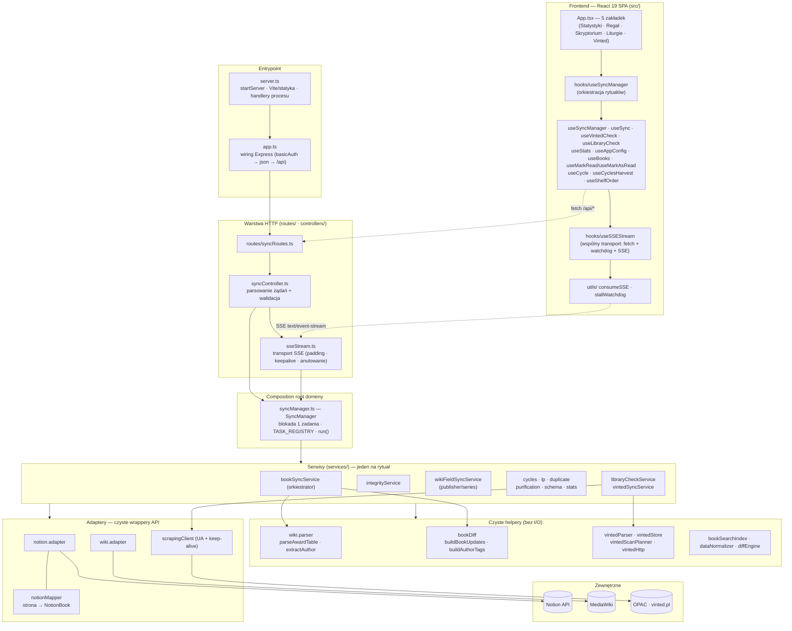

# Cogitator Omnissiah

**Cogitator Omnissiah** synchronizuje nagrody literackie science‑fiction — **Hugo**, **Nebula** i **Locus** — z *Archiwum Encyklopedii Fantastyki* (MediaWiki) do osobistej bazy **Notion**. Zbiera zwycięzców i nominowanych, wzbogaca ich o wydawcę, serię i przynależność do cyklu, pilnuje integralności danych i pomaga śledzić postępy czytelnicze oraz szukać fizycznych egzemplarzy w bibliotece i na Vinted.

Interfejs i nazewnictwo utrzymane są w klimacie Warhammer 40k / Adeptus Mechanicus („rytuały synchronizacji", „Duch Maszyny", „sanctity") — to świadoma konwencja, którą należy zachować przy zmianach.

> **Uwaga o naturze projektu.** To osobiste narzędzie jednego użytkownika, nie usługa wieloosobowa. Endpointy nie są uwierzytelniane — uruchamiaj je za prywatnym hostingiem/siecią, nie wystawiaj publicznie bez własnej warstwy autoryzacji.

---

## Spis treści

- [Funkcje (rytuały)](#funkcje-rytuały)
- [Architektura](#architektura)
- [Struktura projektu](#struktura-projektu)
- [Wymagania wstępne](#wymagania-wstępne)
- [Konfiguracja Notion](#konfiguracja-notion)
- [Zmienne środowiskowe](#zmienne-środowiskowe)
- [Uruchomienie lokalne](#uruchomienie-lokalne)
- [Wdrożenie (Render)](#wdrożenie-render)
- [Referencja API](#referencja-api)
- [Potok synchronizacji książek](#potok-synchronizacji-książek)
- [Integralność i idempotencja danych](#integralność-i-idempotencja-danych)
- [Obserwowalność i diagnostyka](#obserwowalność-i-diagnostyka)
- [Rozwiązywanie problemów](#rozwiązywanie-problemów)
- [Testy](#testy)
- [Dokumentacja i konwencje](#dokumentacja-i-konwencje)

---

## Funkcje (rytuały)

Każda operacja to osobne, anulowalne zadanie strumieniowane do UI przez SSE.

| Rytuał | Endpoint | Co robi |
| --- | --- | --- |
| **Synchronizacja Nagród** (book sync) | `POST /api/sync` | Pobiera stronę nagrody z encyklopedii, parsuje zwycięzców i nominowanych, scala duplikaty (jedna książka = wiele nagród) i zapisuje/aktualizuje rekordy w Notion. |
| **Inicjacja Schematu** | `POST /api/sync-schema` | Zakłada/naprawia wymagane kolumny bazy Notion (typy, nazwa kolumny głównej). |
| **Puryfikacja** | `POST /api/sync-purify` | Czyści tytuły z pozostałości składni wiki i natywnego formatowania Notion. |
| **Wydawcy / Serie** | `POST /api/sync-publisher`, `POST /api/sync-series` | Dociąga wydawcę i serię ze strony każdej książki (z weryfikacją autora). |
| **Cykle** | `POST /api/sync-cycles` | Zaznacza „Część cyklu" na podstawie danych ze strony wiki. |
| **Żniwa Cykli** | `POST /api/sync-cycles-harvest` | Materializuje poboczne tomy cykli jako REALNE wiersze (`Kategoria=Tom cyklu`, `Cykl`/`CyklNr`) — oznaczalne i skanowane na Vinted. Idempotentny. |
| **Rekonstrukcja Liczb (Lp)** | `POST /api/sync-lp` | Przenumerowuje kolumnę „Lp" wg roku i tytułu (tylko pozycje nagrodowe — tomy cykli pomijane). |
| **Duplikaty** | `POST /api/sync-duplicates` | Wykrywa potencjalne duplikaty (tytuł + podobieństwo autora). |
| **Sanctity (Integralność)** | `POST /api/sync-integrity` | Porównuje bazę Notion z wiki: liczby per rok/nagroda, unikalność Lp/tytułów. |
| **Statystyki** | `GET /api/stats` | Agregaty do dashboardu (postęp autorów, roczników, pokrycie nagród, biblioteki). |
| **Skryptorium** (wyszukiwarka) | `GET /api/books`, `GET /api/cycle` | Odchudzony indeks rekordów; front filtruje client-side po tytule (PL+oryg) i autorze, diakrytyki-agnostycznie, na żywo. Badge „cykl" otwiera podgląd tomów cyklu (`/api/cycle`, na żądanie, bez zapisu). |
| **Archiwum Cykli** | `GET /api/cycles-harvest` | Zbiorczy widok zebranych cykli (z wierszy `Cykl`): tomy + status, koszt kompletacji z Vinted, oznaczanie przeczytane/posiadane w miejscu. |
| **Konfiguracja** (Sanktuarium Kalibracji) | `GET/PUT /api/app-config` | Knoby aplikacji (diff od defaultów w opisie kolumny `AppConfig`). Otwiera klik w logo. |
| **Regał** (wizualizacja) | `POST /api/mark-as-read`, `POST /api/unmark-as-read`, `POST /api/shelf-order` | Księgozbiór jako fizyczne półki (grzbiety + okładki „Wyróżnione"); dwa regały „Do przeczytania"/„Przeczytane" z drag&drop (zapis/usuwa tag „Przeczytane" w „Źródło"); precyzyjne wstawianie w obrębie dekady zapisuje `ShelfOrder`. Skórki `Holo`/`Noospheric`. |
| **Skan Biblioteki** | `POST /api/library-check` | Sprawdza dostępność w OPAC MBP Lublin (scraping HTML). |
| **Skan Vinted** | `POST /api/vinted-check` | Szuka fizycznych egzemplarzy na vinted.pl (scraping HTML). |

**Rytuał Pełnej Synchronizacji** uruchamia sekwencję 1–7 (Schemat → Puryfikacja → Nagrody → Cykle → Wydawcy → Serie → Lp); przerwanie któregokolwiek kroku zatrzymuje całą sekwencję.

---

## Architektura

Hybryda **Vite + Express** serwowana z jednego procesu Node. Kod jest ułożony w warstwy o jednym kierunku zależności: **entrypoint → HTTP → domena → serwisy → adaptery → API zewnętrzne**. Logika parsowania i diffowania jest wyniesiona do **czystych funkcji** (bez I/O), więc da się ją testować w izolacji; orkiestratory tylko je spinają.



- **Entrypoint** — `server.ts` (start serwera, middleware Vite/statyka, handlery procesu) montuje **`app.ts`** (samo wiring Express: `basicAuth` → `json` → trasy `/api`). Rozdzielenie kasuje cykl `server ↔ controller`.
- **Warstwa HTTP** — `routes/` mapuje endpointy na `controllers/syncController.ts` (parsowanie żądań, walidacja); transport długich zadań SSE żyje osobno w `controllers/sseStream.ts` (nagłówki, hardening pod proxy, keepalive, anulowanie przy rozłączeniu klienta).
- **Composition root domeny** — `syncManager.ts`: `SyncManager` buduje adaptery i serwisy oraz orkiestruje rytuały — jedno aktywne zadanie z własnym tokenem anulowania, rejestr `TASK_REGISTRY` (nazwa → serwis) i jedno generyczne `run(taskName, sendEvent, params?)`. Współbieżność wewnątrz zadań przez `p-limit`.
- **Serwisy** (`/services/`) — po jednym na koncern; orkiestratory (np. `bookSyncService`, `integrityService`) delegują logikę do czystych helperów.
- **Czyste helpery** — `wiki.parser` (`parseAwardTable`), `bookDiff` (`buildBookUpdates`/`buildAuthorTags`/`buildNewBookProperties`), `vintedParser`, `vintedStore` (merge/diff/`computeChangedAt`), `vintedScanPlanner` (`selectAndOrderCandidates`), `vintedHttp` (nagłówki/throttle/klasyfikacja błędu), `bookSearchIndex`, `dataNormalizer`, `diffEngine`: bez I/O, w pełni testowalne.
- **Adaptery** — `NotionAdapter`, `WikiAdapter`: czyste wrappery API bez logiki biznesowej. Mapowanie strona Notion → domena wyniesione do `notionMapper`; skanery HTML (biblioteka/Vinted) dzielą `scrapingClient` (rotacja User-Agent + keep-alive). Adaptery rozróżniają „brak danych" od „awarii infrastruktury" (patrz [Obserwowalność](#obserwowalność-i-diagnostyka)).
- **Frontend** — React 19 SPA (Tailwind CSS, `motion/react`, `lucide-react`), 5 zakładek: Statystyki, **Regał** (wizualizacja półek + drag&drop), **Skryptorium** (wyszukiwarka), Liturgie (rytuały), Vinted. Cała orkiestracja rytuałów w `useSyncManager`. Transport SSE (fetch → `res.ok` → `consumeSSE` + stall watchdog + komunikat błędu) żyje raz w **`useSSEStream`**; hooki strumieniowe (`useSync`, `useVintedCheck`, `useLibraryCheck`) budują na nim i różnią się tylko routingiem zdarzeń. Duży komponent skanera Vinted rozbity na `components/stats/vinted/*`. W dev serwowany przez Vite (middleware), w produkcji jako statyczny build z `dist/`.

Szczegóły zasad architektonicznych: **[`COGITATOR_GUIDELINES.md`](./COGITATOR_GUIDELINES.md)**.

### Stack

- **Frontend:** React 19, Tailwind CSS 4, Motion, Lucide‑React
- **Backend:** Node.js, Express, Axios
- **Integracje:** Notion SDK (`@notionhq/client`), MediaWiki API, OPAC MBP Lublin, vinted.pl
- **Narzędzia:** TypeScript (strict), Vite, tsx, esbuild, Vitest

---

## Struktura projektu

```
.
├── server.ts                # entrypoint: startServer, Vite/statyka, handlery procesu
├── app.ts                   # wiring Express (basicAuth → json → trasy /api)
├── syncManager.ts           # composition root domeny: SyncManager, rejestr rytuałów, run()
├── notion.adapter.ts        # wrapper Notion SDK (zapytania, zapis, schemat, dual-mode)
├── notionMapper.ts          # czyste mapowanie strona Notion → NotionBook
├── wiki.adapter.ts          # klient MediaWiki (fetch treści, kategorie, wyszukiwanie)
├── wiki.parser.ts           # parser wikitekstu (parseAwardTable, extractAuthor, {{tabela wydania}})
├── scrapingClient.ts        # współdzielone dla skanerów HTML: rotacja User-Agent + keep-alive agent
├── retry.ts                 # withRetry — backoff, Retry-After, flaga idempotent
├── logger.ts                # strukturalny logger + klasyfikacja błędów HTTP
├── utils.ts                 # cleanTitle, sanitize, similarity, countCommonWords
├── controllers/
│   ├── syncController.ts    # parsowanie żądań + walidacja (delegacja do serwisów)
│   └── sseStream.ts         # transport SSE (headers, keepalive, anulowanie)
├── routes/                  # definicje endpointów
├── services/                # logika biznesowa (jeden serwis = jeden rytuał) + czyste helpery
│   ├── bookSyncService.ts   bookDiff.ts          dataNormalizer.ts   diffEngine.ts
│   ├── duplicateSyncService.ts   wikiFieldSyncService.ts  publisherSyncService.ts  seriesSyncService.ts
│   ├── cyclesSyncService.ts      lpSyncService.ts          statsService.ts       bookSearchIndex.ts
│   ├── purificationService.ts    schemaValidationService.ts  integrityService.ts
│   ├── libraryCheckService.ts    vintedSyncService.ts       vintedParser.ts
│   ├── vintedStore.ts            vintedScanPlanner.ts       vintedHttp.ts
├── src/                     # frontend React
│   ├── App.tsx  types.ts  constants.ts
│   ├── components/          # + stats/vinted/ (skaner), search/ (Skryptorium), shelf/ (Regał)
│   ├── hooks/               # useSyncManager, useSSEStream (transport), useSync, useVintedCheck,
│   │                        #   useLibraryCheck, useStats, useAppConfig, useBooks, useCycle,
│   │                        #   useCyclesHarvest, useShelfOrder, useMarkRead/useMarkAsRead, …
│   ├── utils/               # sse (consumeSSE), stallWatchdog, time, bookSearch, bookshelf,
│   │                        #   vintedOffers, vintedSellers, vintedFormat
│   └── theme/               # ritualColors (motyw kolorów rytuałów)
├── docs/                    # szczegółowa dokumentacja algorytmów (per serwis)
├── render.yaml              # blueprint wdrożenia na Render
└── .claude/                 # hook SessionStart (npm install) dla Claude Code on the web
```

---

## Wymagania wstępne

- **Node.js 18+** (build celuje w `node18`; rozwijane na Node 20/22).
- Konto **Notion** z integracją i bazą danych.
- Testy działają bez żadnych sekretów — wszystkie usługi zewnętrzne są mockowane.

---

## Konfiguracja Notion

1. Utwórz **integrację** w [notion.so/my-integrations](https://www.notion.so/my-integrations) i skopiuj *Internal Integration Token* → to `NOTION_API_KEY`.
2. Utwórz (lub wskaż) bazę danych i **udostępnij ją integracji** (menu `•••` → *Connections* → wybierz integrację). Bez tego kroku Notion zwróci `object_not_found`.
3. Skopiuj **ID bazy** z URL (32‑znakowy ciąg) → to `NOTION_DATABASE_ID`.
4. Kolumny nie muszą istnieć wcześniej — uruchom rytuał **Inicjacja Schematu** (`/api/sync-schema`), który założy brakujące:

   | Kolumna | Typ |
   | --- | --- |
   | `Lp` | title (kolumna główna) |
   | `Autor`, `Rok`, `Wydawnictwo`, `Seria`, `Nagroda`, `Źródło` | multi_select |
   | `Tytuł polski`, `Tytuł oryginalny`, `Cykl`, `VintedData` | rich_text |
   | `Część cyklu` | checkbox |
   | `Kategoria` | select (`Nagroda` / `Tom cyklu`) |
   | `CyklNr`, `ShelfOrder` | number |

   - `Źródło` — znaczniki `Przeczytane`, `Posiadam`, `Biblioteka`, `Biblioteka 9` (statystyki, skany, oznaczanie).
   - `Kategoria`/`Cykl`/`CyklNr` — model cykli-jako-wierszy (poboczne tomy oddzielone od nagród; puste `Kategoria` = pozycja nagrodowa).
   - `VintedData` — blob wyników skanu Vinted; `ShelfOrder` — ręczny porządek regału.
   - `AppConfig` (rich_text) — nośnik konfiguracji: knoby żyją w **opisie** tej kolumny, nie w wierszach.

---

## Zmienne środowiskowe

Skopiuj `.env.example` do `.env` i uzupełnij:

| Zmienna | Wymagana | Opis |
| --- | --- | --- |
| `NOTION_API_KEY` | ✅ | Token integracji Notion. |
| `NOTION_DATABASE_ID` | ✅ | ID docelowej bazy Notion. |
| `PORT` | ➖ | Port serwera (domyślnie `3000`). |
| `BASIC_AUTH_USER` / `BASIC_AUTH_PASSWORD` | ➖ | Ustaw **obie**, aby włączyć ochronę hasłem (HTTP Basic Auth) na publicznym URL. Puste = brak autoryzacji. |

---

## Uruchomienie lokalne

```bash
npm install
npm run dev      # serwer dev (tsx server.ts) — API + frontend Vite na http://localhost:3000
```

Pozostałe komendy:

```bash
npm run build    # vite build + esbuild bundle server.ts → dist/server.cjs
npm start        # uruchom produkcyjny build (node dist/server.cjs)
npm run lint     # tsc --noEmit (tryb strict; brak osobnego lintera)
npm test         # vitest run (pełny pakiet)
npx vitest run <ścieżka>   # pojedynczy plik testowy
```

Port pochodzi ze zmiennej `PORT` (domyślnie `3000`).

> **Wskazówka.** Encyklopedia bywa chroniona przed ruchem z centrów danych. Jeśli synchronizacje działają lokalnie, ale nie na hostingu, zobacz [Rozwiązywanie problemów](#rozwiązywanie-problemów).

---

## Wdrożenie (Render)

Repozytorium zawiera blueprint **[`render.yaml`](./render.yaml)**:

- **Runtime:** Node
- **Build:** `npm ci --include=dev && npm run build`
- **Start:** `npm start`
- **Health check:** `/api/health`
- **Zmienne:** ustaw `NOTION_API_KEY`, `NOTION_DATABASE_ID` (oraz opcjonalnie `BASIC_AUTH_USER`/`BASIC_AUTH_PASSWORD`) jako sekrety; `NODE_ENV=production`.

Możesz wdrożyć jako *Blueprint* (Render odczyta `render.yaml`) albo ręcznie jako *Web Service* z powyższymi ustawieniami. Na darmowym planie instancja usypia po ~15 min bezczynności (pierwsze wejście po przerwie trwa ~30–60 s).

SSE za proxy Rendera jest zahartowane po stronie serwera (padding wymuszający flush, `X-Accel-Buffering: no`, częsty keepalive) — patrz [Rozwiązywanie problemów](#rozwiązywanie-problemów).

### Bezpieczeństwo

To narzędzie osobiste bez wieloużytkownikowej autoryzacji, ale na publicznym URL warto je chronić:

- **Ochrona hasłem (opt-in):** ustaw `BASIC_AUTH_USER` + `BASIC_AUTH_PASSWORD`, aby wymusić HTTP Basic Auth na całym serwisie (SPA + API). Bez tych zmiennych autoryzacja jest wyłączona (brak lockoutu). `/api/health` pozostaje otwarte dla health checku.
- **Walidacja mutacji schematu:** `PATCH /api/notion/schema` przyjmuje wyłącznie typy `select`/`multi_select` i poprawną listę opcji `{ name }` — reszta jest odrzucana (400).

---

## Referencja API

Wszystkie endpointy synchronizacji zwracają strumień **SSE** (`text/event-stream`) ze zdarzeniami `status` / `progress` / `complete` / `error`. Endpointy odczytu zwracają JSON.

| Metoda | Ścieżka | Opis |
| --- | --- | --- |
| GET | `/api/health` | Status serwera + `isSyncing`. |
| GET | `/api/config` | Obecność kluczy (booleany, bez sekretów). |
| GET | `/api/diagnostics` | **Diagnostyka end‑to‑end** (Notion + pobranie i parsowanie stron nagród) z podsumowaniem po polsku. |
| GET | `/api/stats` | Agregaty do dashboardu. |
| GET | `/api/books` | Odchudzony indeks Skryptorium (wyszukiwarka client-side). |
| GET | `/api/cycle` | Podgląd tomów cyklu dla książki (`?title&author`, na żądanie, bez zapisu; 404 gdy poza cyklem). |
| GET | `/api/cycles-harvest` | Zbiorczy widok zebranych cykli (z wierszy) do Archiwum. |
| GET / PUT | `/api/app-config` | Odczyt / zapis knobów aplikacji (diff od defaultów w opisie kolumny `AppConfig`). |
| GET | `/api/notion/schema` | Bieżący schemat bazy. |
| PATCH | `/api/notion/schema` | Modyfikacja opcji właściwości. |
| GET | `/api/wiki/last-update` | Data ostatniej edycji strony wiki. |
| POST | `/api/sync` | Synchronizacja nagród (`{ awardName, pageTitle, syncAll }`). |
| POST | `/api/sync-schema`, `/api/sync-purify`, `/api/sync-publisher`, `/api/sync-series`, `/api/sync-cycles`, `/api/sync-cycles-harvest`, `/api/sync-lp`, `/api/sync-duplicates`, `/api/sync-integrity` | Pozostałe rytuały. |
| POST | `/api/library-check`, `/api/vinted-check` | Skany dostępności. |
| POST | `/api/mark-as-read`, `/api/unmark-as-read` | Dopisanie / usunięcie znacznika `Źródło` (`Przeczytane`/`Posiadam`/`Biblioteka…`). |
| POST | `/api/shelf-order` | Zapis ręcznego porządku regału (precyzyjny drag&drop). |
| POST | `/api/*/stop` | Zatrzymanie danego rytuału. |
| POST | `/api/sync/reset` | Awaryjny reset stanu synchronizacji. |

---

## Potok synchronizacji książek

1. **Zbieranie** — `WikiAdapter` pobiera wikitekst strony nagrody; czysta `WikiParser.parseAwardTable` parsuje tabelę zwycięzców i nominowanych (obsługa remisów, wierszy `rowspan`, książek wielu autorów, dodatkowej kolumny Retro Hugo, wykluczenia kategorii Locus YA). `bookSyncService` jest tu tylko orkiestratorem (fetch → parser → zdarzenia SSE).
2. **Scalanie i normalizacja** — jedna książka zdobywająca kilka nagród zostaje scalona w jeden rekord; `dataNormalizer` ujednolica autorów/wydawców/tytuły; przy Hugo + Nebula + Locus dokładany jest tag „Wszystkie".
3. **Zapis do Notion** — budowana jest mapa istniejących rekordów; czyste buildery z `bookDiff` tworzą payloady (`buildNewBookProperties` dla nowych, `buildBookUpdates` **pole po polu** dla istniejących — aktualizacja tylko przy realnej zmianie); brak zmian → pominięcie (oszczędność limitów API).
4. **Raport na żywo** — SSE strumieniuje `status`/`progress`, a `complete` niesie podsumowanie (dodane / zaktualizowane / pominięte / duplikaty).

Szczegóły algorytmów: **[`docs/`](./docs)** (patrz [indeks](./docs/README.md)).

---

## Integralność i idempotencja danych

- **Scalanie autorów, nie nadpisywanie** — autorzy dopisani ręcznie w Notion nigdy nie znikają.
- **Porównania case‑insensitive dla multi_select** — Notion dopasowuje opcje bez względu na wielkość liter i zachowuje własną pisownię, więc różnica samej wielkości liter nie wywołuje pozornych aktualizacji przy każdym syncu.
- **Najnowsze wydanie jest miarodajne** — wydawca i seria pochodzą z najnowszego wydania z `{{tabela wydania}}`, bez mieszania pól między wydaniami.
- **Weryfikacja autora** przy synchronizacji wydawców/serii/cykli — strona o tym samym tytule dotycząca innego dzieła nie nadpisze danych.
- **Rozróżnienie awarii od braku danych** — pełna awaria pobierania nie raportuje się jako „udany, pusty" sync (patrz niżej).

Decyzje projektowe (np. kategorie Locus, priorytet wydania) są udokumentowane w `docs/` i `COGITATOR_GUIDELINES.md` z adnotacją „nie naprawiać wstecz".

---

## Obserwowalność i diagnostyka

- **Strukturalny logger** (`logger.ts`) — jedna linia na wpis: `[POZIOM] [Komponent] wiadomość {kontekst}`. Bez sekretów.
- **Klasyfikacja błędów** — nieudane żądanie HTTP jest mapowane na przyczynę: `ip_blocked` (403/Cloudflare), `rate_limited` (429), `server_error` (5xx), `timeout`, `dns`, `http_error` — z podpowiedzią dla użytkownika.
- **`WikiFetchError`** — adapter wiki rzuca typowany błąd niosący klasyfikację i wskazówkę, którą kontroler pokazuje w UI.
- **`GET /api/diagnostics`** — jedno wywołanie sprawdzające Notion oraz pobranie i sparsowanie każdej strony nagrody; zwraca raport JSON z podsumowaniem po polsku. Najszybszy sposób ustalić, dlaczego sync nie działa. Dostępny też jako przycisk **„Uruchom Diagnostykę"** w karcie Status.

---

## Rozwiązywanie problemów

| Objaw | Prawdopodobna przyczyna | Co zrobić |
| --- | --- | --- |
| Sync kończy się błędem `ip_blocked` / HTTP 403 | IP serwera (np. hosting) jest blokowane przez encyklopedię/Cloudflare | Uruchom lokalnie / z innej sieci, albo użyj proxy o zaufanym IP. Potwierdź przez `/api/diagnostics`. |
| Notion: `object_not_found` | Baza nieudostępniona integracji lub błędne `NOTION_DATABASE_ID` | Udostępnij bazę integracji (*Connections*) i sprawdź ID. |
| „Sparsowano 0 książek" mimo pobrania strony | Zmieniony tytuł strony w encyklopedii lub układ tabeli | Sprawdź logi `[BookSync]` i tytuły w kodzie; porównaj ze stroną wiki. |
| UI „nie reaguje" / brak postępu na hostingu | Buforowanie strumienia SSE przez proxy | Zahartowane po stronie serwera (padding + `X-Accel-Buffering: no` + keepalive). Klient ma watchdog 30 s, który pokaże komunikat zamiast martwego UI. |

Zawsze zaczynaj od **`/api/diagnostics`** i logów — pole `summary` zwykle wprost wskazuje przyczynę.

---

## Testy

Vitest, uporządkowane w podkatalogach `__tests__/`:

- `/__tests__/` — infrastruktura, adaptery, serwer (`@vitest-environment node`)
- `/services/__tests__/` — logika biznesowa i serwisy synchronizacji
- `/src/__tests__/` — komponenty UI (JSDOM)
- `/src/hooks/__tests__/` — custom hooki (m.in. obsługa SSE w `useSync`)

Wszystkie usługi zewnętrzne (Notion SDK, axios) są mockowane przez `vi.mock`, więc testy działają bez sekretów.

```bash
npm test        # pełny pakiet
npm run lint    # type-check w trybie strict
```

---

## Dokumentacja i konwencje

- **[`COGITATOR_GUIDELINES.md`](./COGITATOR_GUIDELINES.md)** — autorytatywne zasady architektoniczne (backend, frontend, integralność danych, testy, design system). Obowiązują przy każdej zmianie.
- **[`docs/`](./docs)** — szczegółowa dokumentacja algorytmów per serwis ([indeks](./docs/README.md)).
- **[`CLAUDE.md`](./CLAUDE.md)** — zwięzła mapa projektu dla asystenta Claude Code.

Konwencje: Tailwind CSS (motyw glassmorphism, `slate-950` + akcenty `cyan-400`/`purple-500`), `motion/react` do animacji, `lucide-react` do ikon; nazewnictwo i teksty UI w klimacie Adeptus Mechanicus. Po większych zmianach architektonicznych aktualizuj `COGITATOR_GUIDELINES.md` i ten plik (zob. wytyczne §8).

---

*Ku chwale Omnissiaha — w służbie zachowania literackich artefaktów w epoce cyfrowej.*
